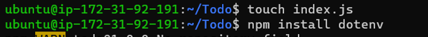
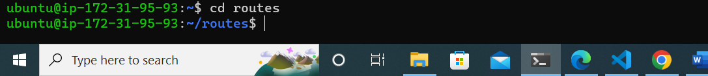

##  **PROJECT 3 IMPLEMENTATION/DOCUMENTATION (MERN STACK)**

## STEP 1 – BACKEND CONFIGURATION

### The backend configuration started with the ubuntu update and upgrade

`sudo apt update`

`sudo apt upgrade`

### Getting the location of Node.js software from Ubuntu repositories

`curl -sL https://deb.nodesource.com/setup_14.x | sudo bash -`

### Node.js installation followed

`sudo apt-get install -y nodejs`

### Node installation was then confirmed
`node -v`

`npm -v`

### Application code set up begin by creating a new directory for the To-do application

`mkdir Todo`

### Followed by the initialisation of the project MERN

`npm init`

### Confirmation of package.json in the todo folder

`ls`

## Installation of Expressjs which serves as framework for Node.js

`npm install express`

## Creation of index.js file in the Todo folder

`touch index.js`

## Installation of dotenv

`npm install dotenv`

## Saving codes in the index.js 

`vim index.js`

## Starting of the server to confirm its working 

`node index.js`

## . Opening up port 5000
## . Open up the web browser to access the created server using public IP or public DNS name, followed by the port :5000

## for each task of
. POST

. GET or

. DELETE
## routes folder was created which defines various endpoints that the To-do app depends on

`mkdir routes`

## Then, cd into routes and created file api.js in the routes folder and open the api.js file

`cd routes`

`touch api.js`

`vim api.js`

## Mongoose is installed which is a Node.js package that makes working with mongodb easier

`npm install mongoose`

## A new folder models created

`mkdir models`

## Then I cd into  and todo.js file created inside the models folder

`cd models`

`touch todo.js`

## Opened up the file todo.js created

`vim todo.js`

## api.js file was opened inside the routes directory

`vim api.js`

## mongoDB database was successfully created

## A file name .env was created in the file Todo directory

`touch .env`

`vi .env`

## I proceeded to update the index.js file to allow Node.js to connect to the database

` vim index.js`

## I then started the server

` node index.js`

## CRUD operation was performed using postman app to test functionality of API

`node index.js`

## STEP 2 – FRONTEND CONFIGURATION

## In root directory (Todo directory)  create-react-app command was used to scaffold our app by creating a directory called client

`npx create-react-app client`

## Concurrently was installed as one of depeendencies which is used to run more than one commands at the same time from the same window terminal before testing the react-app

`npm install concurrently --save-dev`

## Nodemon installed which is used to run and monitor the server

`npm install nodemon --save-dev`

## Nodemon installed which is used to run and monitor the server

`npm install nodemon --save-dev`

## The package.json file in the Todo folder was edited

`vim package.json`

## Configuring proxy in package.json
. Firstly change directory to client  
. Open the package.json file  
. Add the key value pair in the package.json file "proxy": "http://localhost:5000"

`cd client`

`vi package.json`

## Nodemon installed which is used to run and monitor the server

`npm run dev`

## Accessing the App on the web browser

## Creating react components
. From Todo directory, I cd into client  
. Then I moved to the src directory  
. A folder known as components was created in the src folder  
. Then I moved into the created components folder  
. Inside ‘components’ directory the following three files Input.js, ListTodo.js and Todo.js are created

`cd client`

`cd src`

`mkdir components`

`cd components`

`touch Input.js ListTodo.js Todo.js`

## Opened input.js file

`vi Input.js`

## Making use of Axios
. I moved to the src folder  
. And then moved to clients folder  
. Then, I installed AXIOS

`npm install axios`

## To ‘components’ directory

`cd src/components`

## Then I opened the ListTodo.js

`vi ListTodo.js`

## Then I opened the ListTodo.js

`vi ListTodo.js`

## Then the Todo.js file is edited

`vi Todo.js`

. Move to src folder  
. Open vi App.js and edited as stated in the documentation

`vi App.js`

## In the src directory the App.css was opened and edited as stated in the documentation

`vi App.css`

## In the src directory the index.css was opened and edited as stated in the documentation

`vi index.css`

. Then went back to the Todo directory to run the below code

`npm run dev`

. I then finally log into the public IP on the browser to confirm functionality of the TO-DO APP

